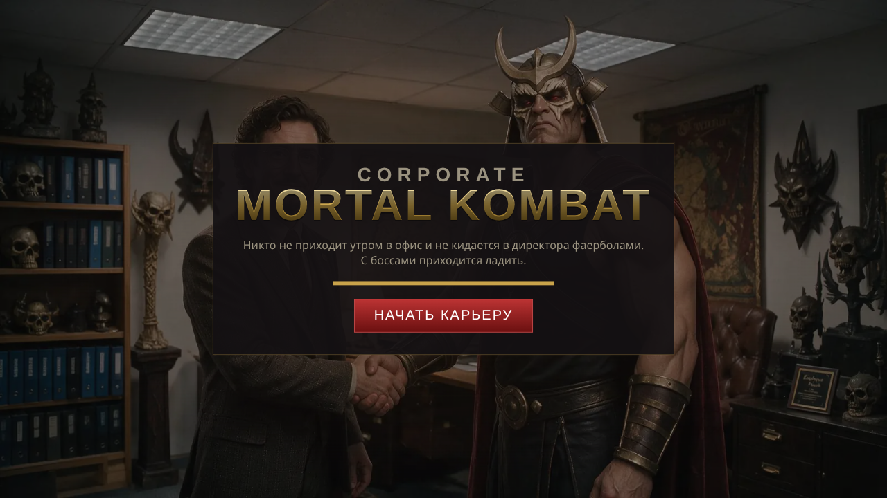
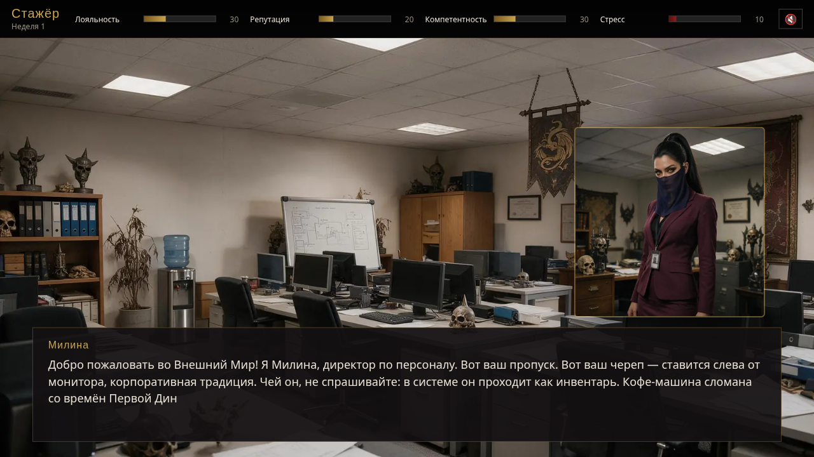
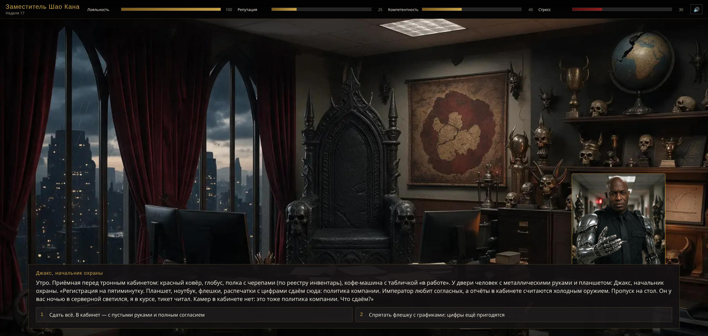
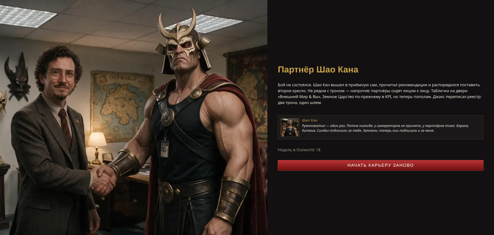
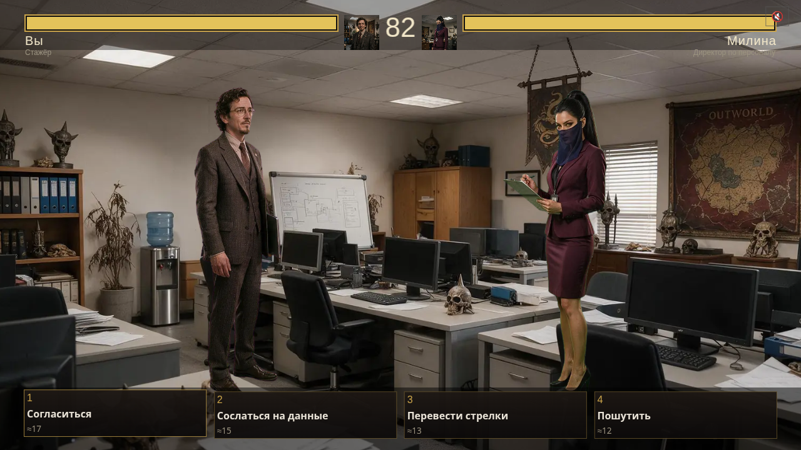
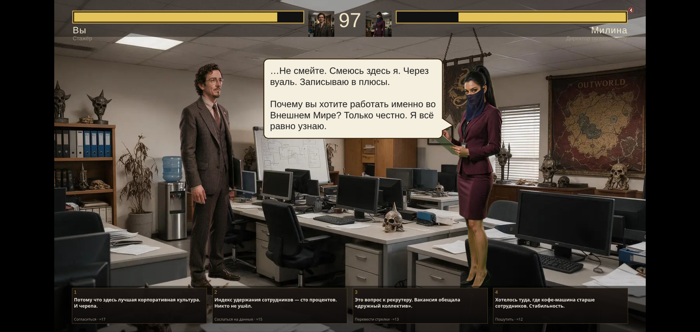
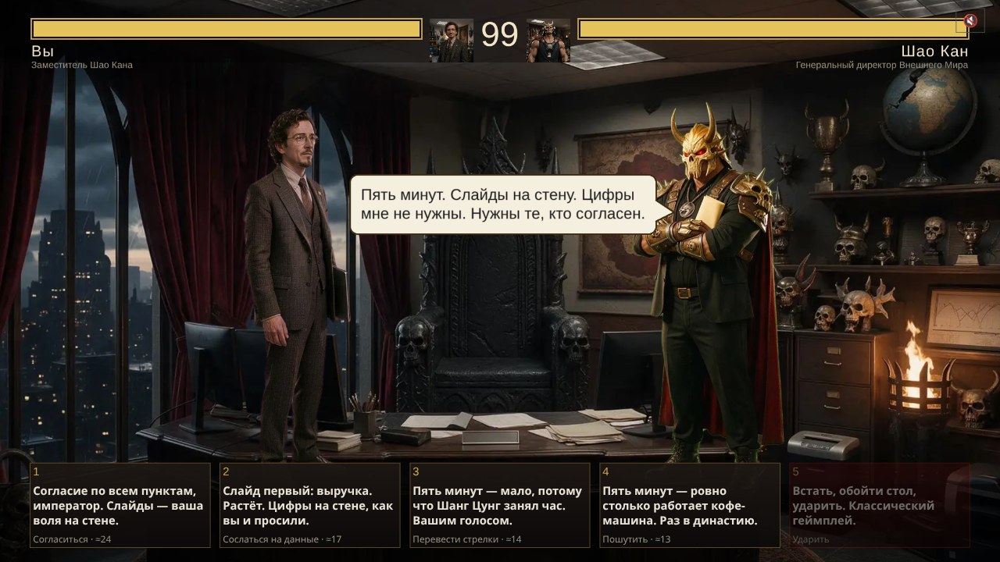
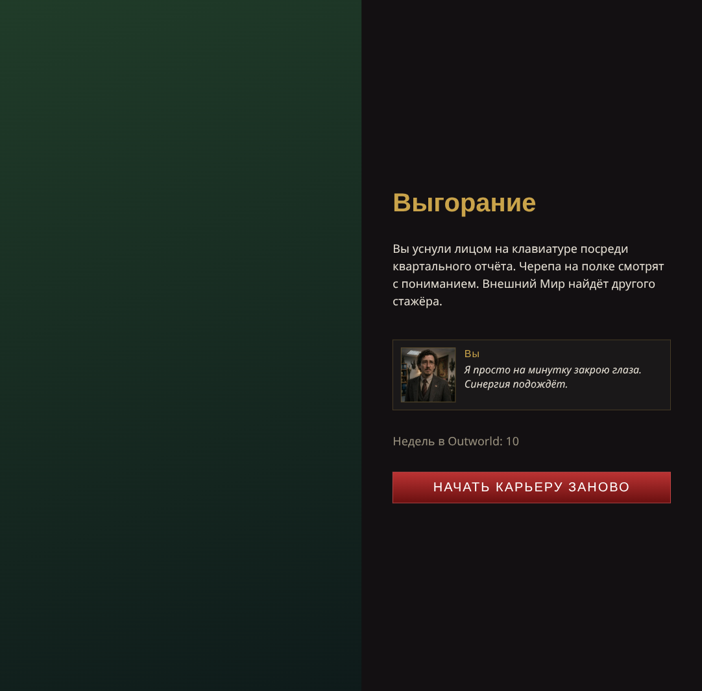
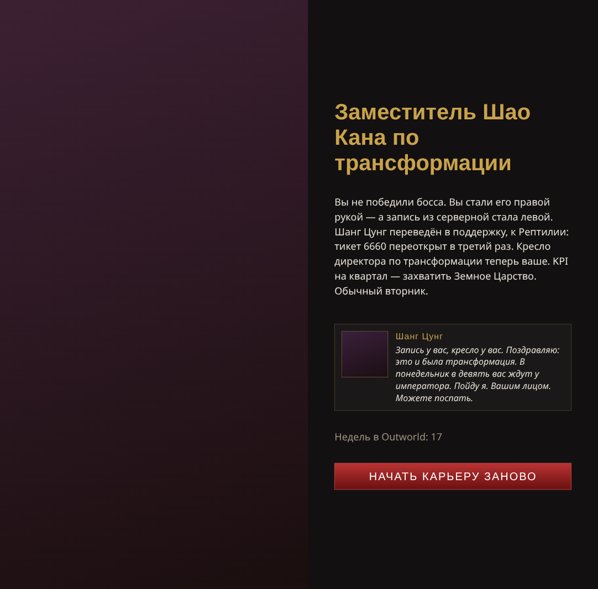

# Corporate Mortal Kombat

Пародийная игра: карьера в корпорации Внешнего Мира вместо драки с Шао Каном.

Игра будет по адресу [`https://wowsel.github.io/corporate-mortal-combat/`](https://wowsel.github.io/corporate-mortal-combat/).

## Как играть

Браузерная игра, ничего ставить не нужно — открываете ссылку и играете.
Каждая ступень карьеры — это два события с выбором (хоткеи 1–4, клик по
тексту досказывает реплику целиком, `Enter` — «Дальше») и бой-переговоры с
боссом в форме диалога: каждый ход босс говорит реплику, а четыре карточки
внизу — готовые ответы героя (1 согласие, 2 данные, 3 стрелки, 4 шутка) с
мелкой подписью тактики и ожидаемого урона; босс реагирует на выбранный ответ
и задаёт следующий вопрос в том же облачке, которое висит, пока игрок думает
(таймер в это время стоит). У финального босса, Шао Кана, открывается пятая
карточка «Ударить» — но только после баннера `FINISH HIM`. Четыре
стата — Лояльность, Репутация, Компетентность и Стресс; Стресс 100 —
концовка «Выгорание». Проигрыш боссу не выкидывает из игры, а повторяет
ступень заново. Четвёртая концовка «Партнёрство»: с двумя из трёх
рекомендаций боссов (Барака, Китана, Синдел) в приёмной Шао Кана бой можно
не начинать вовсе. Порядок реплик в боях тасуется в каждой новой партии.
Итого четыре концовки, а у концовки-повышения два варианта
текста в зависимости от выбора, сделанного на ступени 4 (Шанг Цунг).

## Баланс

Числа в таблице ниже — вывод симулятора `tools/simulate.ts` (`npx tsx
tools/simulate.ts 1000`) для двух стратегий: «events=best fight=weakness»
(на событиях всегда выбирается вариант с лучшим суммарным эффектом на статы,
в бою — приём по слабости босса) и «events=random fight=random» (случайный
выбор и случайный приём).

```
=== events=best fight=weakness: promotion 99%
┌─────────┬─────────────┬─────────────┬──────────┬───────────┐
│ (index) │ boss        │ firstTryWin │ avgTurns │ avgStress │
├─────────┼─────────────┼─────────────┼──────────┼───────────┤
│ 0       │ 'Милина'    │ '100%'      │ '4.0'    │ '0'       │
│ 1       │ 'Барака'    │ '100%'      │ '4.0'    │ '0'       │
│ 2       │ 'Китана'    │ '100%'      │ '5.0'    │ '0'       │
│ 3       │ 'Синдел'    │ '96%'       │ '7.0'    │ '5'       │
│ 4       │ 'Шанг Цунг' │ '100%'      │ '6.0'    │ '0'       │
│ 5       │ 'Шао Кан'   │ '100%'      │ '5.0'    │ '0'       │
└─────────┴─────────────┴─────────────┴──────────┴───────────┘

=== events=random fight=random: promotion 0%
┌─────────┬─────────────┬─────────────┬──────────┬───────────┐
│ (index) │ boss        │ firstTryWin │ avgTurns │ avgStress │
├─────────┼─────────────┼─────────────┼──────────┼───────────┤
│ 0       │ 'Милина'    │ '92%'       │ '6.7'    │ '18'      │
│ 1       │ 'Барака'    │ '76%'       │ '6.8'    │ '15'      │
│ 2       │ 'Китана'    │ '25%'       │ '7.1'    │ '21'      │
│ 3       │ 'Синдел'    │ '2%'        │ '6.7'    │ '30'      │
│ 4       │ 'Шанг Цунг' │ '10%'       │ '6.7'    │ '30'      │
│ 5       │ 'Шао Кан'   │ '0%'        │ '6.0'    │ '10'      │
└─────────┴─────────────┴─────────────┴──────────┴───────────┘
```

Итоговые числа боссов (терпение / атака / слабость / иммунитет): Милина
90/10 joke/blame, Барака 110/11 agree/joke, Китана 140/12 data/agree, Синдел
170/13 blame/joke, Шанг Цунг 185/13 data/blame, Шао Кан 190/15 agree/data.
В каждом бою терпение босса и его атака уравновешивают друг друга: спека
задавала Шао Кану атаку 14, но симуляция и плейтест этапа 8 подняли её до
15 — при 14 шести-ходовые бои с игроком в нейтральном режиме иногда давали
спираль Выгорания после одного проигрыша.

## Как это сделано

Полная спека — [`docs/superpowers/specs/2026-09-03-corporate-mortal-kombat-design.md`](docs/superpowers/specs/2026-09-03-corporate-mortal-kombat-design.md),
планы этапов разработки — [`docs/superpowers/plans/`](docs/superpowers/plans/).
Стек: Vite 6 + TypeScript (строгий режим) + PixiJS 8 (рендер боя) + GSAP
(хореография) + Vitest (тесты чистой логики). Весь контент ступеней, боссов,
событий и концовок — данные в `src/content/ranks/*.ts`, валидатор проверяет
их согласованность при старте игры. Ассеты (картинки, музыка, голос диктора)
генерируются через OpenRouter по манифесту `assets/manifest.json`.

## Деплой

GitHub Actions workflow `.github/workflows/pages.yml` при каждом пуше в
`main` собирает `dist/` (`npm ci --ignore-scripts && npm test && npm run
build`) и публикует его на GitHub Pages. Локально подпуть GitHub Pages можно
проверить так — `vite preview` его не воспроизводит:

    npm run build && (cd .. && python3 -m http.server 8080)

и открыть `http://localhost:8080/corporate-mortal-combat/dist/`.

## Разработка

    npm install --ignore-scripts
    npm run dev        # http://localhost:5173
    npm test
    npm run build      # dist/

## Структура

- `src/` — ядро: `state.ts` (прогрессия), `battle.ts` (формула боя), `choreo.ts` (хореография хода), `engine.ts` (роутер экранов), `hud.ts`, `assets.ts`, `audio.ts`
- `src/screens/` — экраны: титул, событие (визуальная новелла), бой, концовка
- `src/render/` — Pixi-сцена боя и эффекты (вспышки, тряска, баннеры, частицы)
- `src/content/` — контент: ступени, боссы, события, концовки, валидатор
- `assets/` — манифест ассетов и референсы; `assets/raw/` — сырые сгенерированные файлы (не в git)
- `tools/` — генерация ассетов через OpenRouter (этап 2): `env.ts` читает `.env`, `manifest.ts` работает с манифестом, `openrouter.ts` — клиент API, `gen-assets.ts` — CLI генерации, `check-assets.ts` — проверка манифеста, `postprocess.py` — хромакей/кроп/якорь
- `public/assets/` — готовые ассеты игры (webp/mp3), путь к ним в манифесте относителен этой папки
- `docs/superpowers/` — спека и планы этапов

## Ассеты

Генерация ассетов идёт через OpenRouter (`tools/gen-assets.ts` + манифест `assets/manifest.json`).

- **Ключ**: положить `OPENROUTER_API_KEY=...` в `.env` в корне репозитория (файл в `.gitignore`, никогда не коммитится).
- **Оценка стоимости без трат**: `npm run gen -- --dry-run` — печатает список записей манифеста и их стоимость, ничего не генерирует и не тратит бюджет.
- **Генерация группы**: `npm run gen -- --group <name>` (например `core`, `rank0`, `endings`) — генерирует все записи манифеста этой группы.
- **Точечная генерация**: `npm run gen -- --only id1,id2` — генерирует только перечисленные id; добавить `--force`, чтобы перегенерировать уже готовые записи.
- **Проверка манифеста**: `npm run assets:check` — таблица по всем записям (сгенерировано/нет, размер файла, превышение бюджета) и сводка снизу.
- **Бэкап сырья**: `assets/raw/` — единственный источник опорной внешности героя (`pt_hero_neutral.png` лежит в git как identity-якорь, остальное — нет); держите копию папки вне репозитория, иначе перегенерация персонажа даст другое лицо.
- **Где что лежит**: сырые сгенерированные файлы — в `assets/raw/` (в git только `pt_hero_neutral.png`, остальное — `.gitignore`); готовые ассеты игры — в `public/assets/img/**` (webp) и `public/assets/audio/**` (mp3/wav), путь к ним в манифесте относителен `public/assets/`.
- **Постобработка** (`tools/postprocess.py`, проверяется `npm run test:py`): хромакей-цвет фона автооценивается по медиане рамки картинки (не фиксированная маджента), для четырёх поз одного персонажа вырезается общий (shared) кроп, а якорь (anchor) точки опоры записывается обратно в манифест.
- Art-проход выполнен 2026-09-04: все 68 записей манифеста `generated: true` (`npm run assets:check` — missing 0, over budget 0, 5.0 MB). Пересъёмка одной записи: `npm run gen -- --only <id> --force`; без `--force` существующее сырьё в `assets/raw/` пропускается, а постобработка (кроп, webp, mp3) выполняется заново. Перед `--force` сохранить старый raw — у трёх поз одного персонажа общий кроп, и новая поза может сдвинуть остальные.

## Ассеты: заметки по API

Проверено живыми запросами (smoke-тест на первых шагах этапа):

- **Картинки** (`bytedance-seed/seedream-5-0-pro`, `/api/v1/images`, 1K): приходит **JPEG**, а не PNG, хотя поле ответа зовётся `b64_json`. `usage.cost` — **$0.045** за картинку.
- **Диктор** (`openai/gpt-audio-mini`): аудио идёт только стримом (`stream: true`), а при стриме OpenAI принимает лишь `format: 'pcm16'` — mp3/wav отвергаются с 400. Клиент сам повторяет запрос с `pcm16` и заворачивает сырой поток в WAV (24 кГц, моно, 16 бит), поэтому наружу отдаётся **wav**. `usage.cost` — **$0.00007** за реплику из одного слова.
- **Музыка** (`google/lyria-3-clip-preview`): поле `audio` **принимает** (`audioParams: false` не нужен), отдаёт готовый **mp3** 44.1 кГц стерео, ~30 с. `usage.cost` — **$0.04** за клип.
- **Хромакей**: цвет фона больше не фиксирован — `tools/postprocess.py` оценивает его по медиане рамки картинки (модель рисует приглушённую мадженту с виньеткой, а не чистый `#FF00FF`) и берёт адаптивные пороги `near = min(p99(рамки) + 8, 30)`, `far = near + 45` (потолок 30 — иначе фигура, касающаяся рамки, раздувает порог и съедает саму себя); `--chroma` остаётся sanity-подсказкой (расхождение >90 CbCr → аварийный выход: рамка не хромакейная, надо смотреть сырьё), есть ручные `--near/--far`. Плюс проверка на вырожденный кей: непрозрачным должно остаться 2–70% кадра, а рамка — чище 95%, иначе ненулевой код возврата.
- **Зелёный ключ** (`chroma: "#00FF00"`) у Милины, Синдел и Шао Кана: бордовый/фиолетовый/багровый костюм на мадженте уходит в прозрачность. В промптах всех спрайтов — фраза про плоский равномерный chroma-key экран без виньетки, «FULL-LENGTH FULL-BODY», «whole figure inside the frame» и «occupies about 85% of the height»: без них модель рисует студийный фон с градиентом и режет ноги.
- **Модерация Seedream** стохастична и бесплатна (400 → $0). Постер `assets/reference/post-hero-and-shao-kahn.png` как референс в связке с промптами Шао Кана стабильно блокируется — спрайты Шао Кана сгенерированы без референса (idle текстом, остальные позы по idle), титул — по портретам `pt_hero_neutral` + `pt_shao_neutral`.
- **Диктор**: у записей `vo_*` есть поле `system` (инструкция «диктор аркадного автомата, произнеси ровно подпись») и короткий `prompt` — сама фраза. Без system-сообщения `gpt-audio-mini` отказывается, читает ремарки вслух или импровизирует; после генерации транскрипт стоит проверить на слух/через whisper.
- Перегон wav → mp3 и JPEG → webp — задача постобработки.
- Этап 2: герой (2 портрета + 4 спрайта, включая одну пересъёмку) — $0.34.

**Статус:** этап 8 из 8, art-проход и переделка боя в диалог выполнены (2026-09-04): 68 ассетов (54 картинки, 6 музыкальных клипов, 8 реплик диктора) сгенерированы, отсмотрены и задеплоены на GitHub Pages. Потрачено ≈ $3.9 из бюджета $10 (герой $0.43 + art-проход ≈ $3.45, включая пересъёмки и бисект модерации).

## Скриншоты

Титул, событие и бой ступени 0 с настоящим артом:









Ранние скриншоты на заглушках (концовки):




## Лицензия и дисклеймер

Код — MIT (см. `LICENSE`). Пародия. Не связана с Warner Bros. / NetherRealm Studios; Mortal Kombat и имена персонажей — товарные знаки правообладателей.
